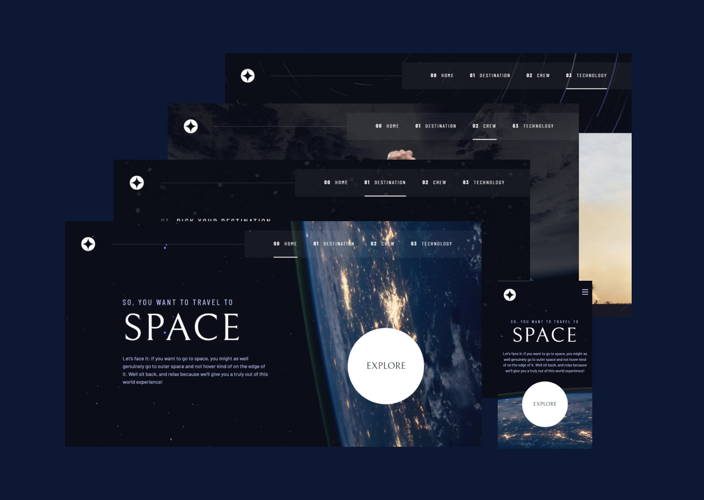

# Frontend Mentor - Space tourism website solution - SPA

This is a solution to the [Space tourism website challenge on Frontend Mentor](https://www.frontendmentor.io/challenges/space-tourism-multipage-website-gRWj1URZ3). Frontend Mentor challenges help you improve your coding skills by building realistic projects.

## Table of contents

- [Overview](#overview)
  - [The challenge](#the-challenge)
  - [Screenshot](#screenshot)
  - [Links](#links)
- [My process](#my-process)
  - [Built with](#built-with)
  - [What I learned](#what-i-learned)
  - [Continued development](#continued-development)
  - [Useful resources](#useful-resources)
- [Author](#author)

## Overview

### The challenge

Users should be able to:

- View the optimal layout for each of the website's pages depending on their device's screen size
- See hover states for all interactive elements on the page
- View each page and be able to toggle between the tabs to see new information
- Personal challenge: add a loading screen.

### Screenshot

### Links

- Solution URL: [URL ]()
- Live Site URL: [URL ]()

## My process

### Built with

- Semantic HTML5 markup
- CSS custom properties
- Flexbox
- CSS Grid
- Mobile-first workflow
- JavaScript
- Single Page Application

### What I learned

Building this project was challenging, but seeing it all coming together was fascinating, and overcoming the problems was satisfying. I got to learn a lot from it. In the design aspect, Kevin Powell's videos helped me understand how to turn a style guide and layouts into custom CSS properties and utility classes. Thus, CSS styles are more readable and reusable. From his videos, I also learned how to make tabs accessible, allowing users to navigate them using the left and right keys instead of the tab key.

The functionality aspect was the biggest challenge. Make the navigation through pages and tabs without using different HTML pages, but making it dynamic with JavaScript was hard. What helped me with this was one of the projects from Web Development for Beginners by Microsoft. So, the solution was to use the window object to retrieve/change the URL and, based on that, update the page content by replacing an element with another from a template tag or its content with data from a JSON file (provided by Frontend Mentor).

### Continued development

This project still has room for improvement, such as implementing a mobile slider for the tabs and loading animations between page navigation. And I'd like to build this, or similar projects, using frameworks like React and React Router or NextJs, and Tailwind for the style.

### Useful resources

- [A (more) Modern CSS Reset](https://andy-bell.co.uk/a-more-modern-css-reset/)
- [Typical Device Breakpoints](https://www.w3schools.com/howto/howto_css_media_query_breakpoints.asp)
- [Web Development for Beginners by Microsoft](https://github.com/microsoft/Web-Dev-For-Beginners) - It's a great project-based course.
- [Create a Design System with CSS - Web Development Course](https://youtu.be/lRaL-8qZ0mM?si=rvT_cV8RazYcndTv) - It's a great course to learn how to approach design and translate it to CSS styles.
- [Responsive navbar tutorial using HTML CSS & JS](https://youtu.be/HbBMp6yUXO0?si=yUO4wXRsQ8tuvbkK) - A complement to the Create a Design System with CSS.
- [Create Accessible Tabs with HTML, CSS & JS](https://youtu.be/fI9VM5zzpu8?si=17Q90d1hg1MFGewa) - It's a necessary video to learn more about accessibility on the web.
- [Reset tabindex for initial keyboard navigation _and_ scrollIntoView for mouse users](https://stackoverflow.com/questions/77223568/reset-tabindex-for-initial-keyboard-navigation-and-scrollintoview-for-mouse-us) - It helped me with a bug in the skip-to-content.
- [Eliminate Jank with Aspect Ratio](https://youtu.be/4-d_SoCHeWE?si=AWzvhY3dQL2T3Sky) - It's a great video about how to improve image load.

## Author

- Frontend Mentor - [AnaCarolina](https://www.frontendmentor.io/profile/AnaCarol2001)
